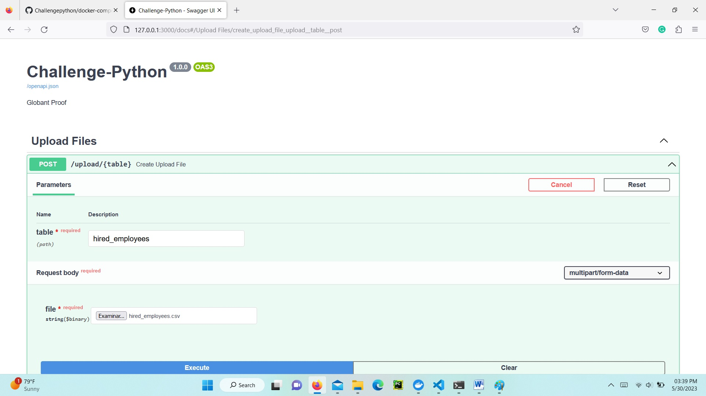
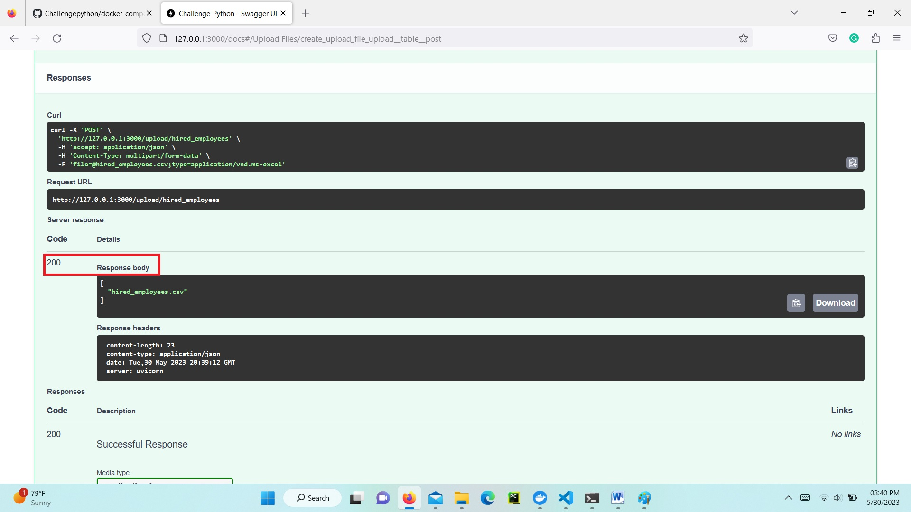

# Globant’s Data Engineering Coding Challenge
Welcome to Globant’s Data Engineering coding challenge!

You will find several different sections in here. Mind that:

* You can choose which sections to solve based on your experience and available time
* if you don’t know how to solve a section, you can proceed with the following one
* You can use whichever language, libraries, and frameworks that you want. 
* The usage of cloud services is allowed, you can choose whichever cloud provider that you want
* Try to always apply best practices and develop a scalable solution.
* We recommend you to solve everything
* If you don’t have time to solve any sections, try to think the toolstack you would like to use and the resulting architecture, and why.
* Every complement you might want to add is highly welcome!
* In case you have a personal github repository to share with the interviewer, please do!

## _Section 1: API_
In the context of a DB migration with 3 different tables (departments, jobs, employees) , create a local REST API that must:

1.	Receive historical data from CSV files
2.	Upload these files to the new DB
3.	Be able to insert batch transactions (1 up to 1000 rows) with one request

You need to publish your code in GitHub. It will be taken into account if frequent updates are made to the repository that allow analyzing the development process. Ideally, create a markdown file for the Readme.md 

Clarifications 
* You decide the origin where the CSV files are located. 
* You decide the destination database type, but it must be a SQL database.
* The CSV file is comma separated. 

__Answer section 1__:

I chose the Fastapi and Sqlalchemy libraries for creating the database and the platform of my API. I used the FastAPI because this library has a simple interface and interaction with the client. For the other part,  the functions, methods, and classes are easy to understand.
In addition, The library Sqlalchemy is easy to manage and has methods that are used to check the format and the content of tables.

How you can execute the programm:
you need docker

go to the Challengepython folder and execute:

```docker
docker-compose up -d

```

and hit in the browser: http://127.0.0.1:3000

or if you do not want to deploy the API in your computer, please open in your browser the web page:

 [http://54.224.14.179/docs](http://54.224.14.179/docs) o 

 [load-balancer-dev-2065286400.us-east-1.elb.amazonaws.com](load-balancer-dev-2065286400.us-east-1.elb.amazonaws.com)  
 
 Everything is loading in the platform cloud of AWS.
 At the night all service will be turn off and the IP address can change.


The files that compose the API are:
main.py is the file that help me to create the environment and the schema to load and ask the information about the number of employees hired and the distribution of them in the time.

Folder config

context.py is the file that connect our API with the database and established a session.

```py
# In ths part i could connect with the database
engine = create_engine(
    "postgresql+psycopg2://{0}:{1}@{2}:{3}/{4}".format(user, password, host, port, database)
    
)
```
```py
# In this part i establish the session of my databse
SessionLocal = sessionmaker(autocommit=False, autoflush=False, bind=engine)

Base = declarative_base()


def get_db():
    db = SessionLocal()
    try:
        yield db
    finally:
        db.close()
```


Folder views.
query.py has the code of in SQL to make the queries in the database.


requirements.py take the queries of the file queries.py and the session of the file config.py and called a function asynchronous that made the queries to the database. Then called the method that retrieve the answer and put that information in a csv file.

```py
router = APIRouter()

# this is a decorator function that made a get and then called the question function
@router.get("/requirements/{query}", tags=["Queries"])
async def question(query, db: session = Depends(get_db)):
    df = pd.read_sql_query(sql[query], engine) # read the query
    stream = io.StringIO()
    df.to_csv(stream, index=False) # save the answer
    response = StreamingResponse(iter([stream.getvalue()]), media_type="text/csv") # get the information for display it in the screen
    response.headers["Content-Disposition"] = "attachment; filename=output.csv"

    return response
```

v_uploads In this file exits all the method that implemented to check the schema and the content of file like null and the certain data was an integer. In the end of the code i filter all the errors an drop of the file and get a good file that is delivers to the database.

```py
# here the code made two function for checking the informacion of each table the first is for check the data is a integer and the second function is for identify the presents of NAN values.
int_validation = [CustomElementValidation(
    lambda i: check_int(i), lambda i: print(i))]
null_validation = [CustomElementValidation(
    lambda d: d is not np.nan, lambda i: print(i))]
```
one of the models for checking the format can be this:

```py
# take each schema of each table and check if values are Null of integer with the funcion Column of library pandas_schema
sch_employee = Schema([
    Column('id', null_validation + int_validation),
    Column('name', null_validation),
    Column('datetime', null_validation),
    Column('department_id', null_validation + int_validation),
    Column('job_id', null_validation + int_validation)
])
```

```py
# this the funcion that upload each file
@router.post("/upload/{table}", tags=["Upload Files"])
async def create_upload_file(table, file: UploadFile = File(...)):
    contents = await file.read() # await the readinf of file 
    s = str(contents, 'utf-8')
    data = StringIO(s)
    df = pd.read_csv(data, names=name_columns_csv[table], sep=',') # Read the csv file
    if table == 'hired_employees': # check what table is.
        errors = sch_employee.validate(df)
    if table == 'jobs':
        errors = sch_jobs.validate(df)
    if table == 'departments':
        errors = sch_departments.validate(df)
```


Folder schemas
tables.py In this files i checked el format of the data of schema of each table and wrote the structure.


## _Section 2: SQL_
You need to explore the data that was inserted in the previous section. The stakeholders ask for some specific metrics they need. You should create an end-point for each requirement. 

### Requirements 

* Number of employees hired for each job and department in 2021 divided by quarter. The table must be ordered alphabetically by department and job. 

* List of ids, name and number of employees hired of each department that hired more employees than the mean of employees hired in 2021 for all the departments, ordered by the number of employees hired (descending).  

__Answer section2:__

The file query.py has the syntax necessarily for making the questions that refers this point.

How to execute the queries:

***write query1 and query2 in the description field. to activate the field please hit in try it out.***

Query 1:

The link that you download the file: http://127.0.0.1:3000/requirements/query1

```sql
select department, job,
	count(case cuarter when 1 then cuarter  end) as "Q1",
	count(case cuarter when 2 then cuarter  end) as "Q2",
	count(case cuarter when 3 then cuarter  end) as "Q3",
	count(case cuarter when 4 then cuarter  end) as "Q4"
	from
	(
		select d.department, j.job, extract (quarter from TO_TIMESTAMP(
		    e.datetime ,'YYYY-MM-DD TO:MI:SS')) as cuarter
		from "hired_employees" e
			inner join "departments" d
			on e.department_id = d.id
			inner join "jobs" j
			on e.job_id = j.id
			where substring(e.datetime,1,4) = '2021') as temp
	group by department, job
    
```


Query 2:

The link that you download the file: http://127.0.0.1:3000/requirements/query1

```sql
select e.department_id as id, d.department, count(*) as hired 
            from "hired_employees" e
                inner join "departments" d
                on e.department_id = d.id
                where substring(e.datetime,1,4) = '2021'
                group by e.department_id, d.department
                having count(*)> (select avg(t.poor) from (select e.department_id, count(*) as poor from "hired_employees" e
									inner join "jobs" j
									on e.job_id = j.id
									where substring(e.datetime,1,4) = '2021'
									group by e.department_id) t)
```
If all the job is good the result is:



and if you what to know that everythong is running good, please you look the response body.



if you have some issue please, check the name of the table and the file. 


## **Bonus Track! Cloud, Testing & Containers**

Add the following to your solution to make it more robust:
* Host your architecture in any public cloud (using the services you consider more adequate)

Answer: All the infrastructure is dealing in AWS, the database, and the API by way of containers.

* Add automated tests to the API
    * You can use whichever library that you want
    * Different tests types, if necessary, are welcome

Answer: All the checking of types and formats are dealing with pandas_schema and sqlalchemy.types.

* Containerize your application
    * Create a Dockerfile to deploy the package

Answer: The API is deploying in ECS (Elastic Container Service) with one ELB (Elastic Load Balancer) for the database I used a RDS of Postgres with all infrastructure of a VPC. All information is registered in the file main.tf. in the folder ConfTerraform.


## _Csv files structures_
**hired_employees.csv:**

| id INTEGER Id of the employee |
| :------------------------------:|
| name STRING Name and surname of the employee |
| datetime STRING Hire datetime in ISO format |
| department_id INTEGER Id of the department which the employee was hired for |
| job_id INTEGER Id of the job which the employee was hired for |


**departments.csv:**

| id INTEGER Id of the department |
| :-------------------------------: |
| department STRING Name of the department |


**jobs.csv:**

| id INTEGER Id of the job |
| :------------------------: |
| job STRING Name of the job |


